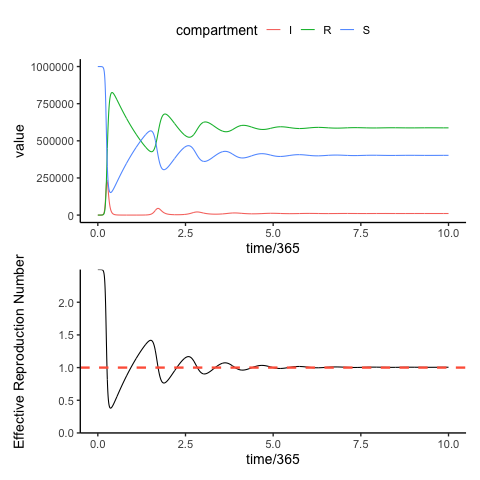

# Differential Equations in Rust

Just playing around with some compartmental models using Rust.
I'm not really sold on it yet, but it is lightening fast.

This could be extended using the `rextendr` package which could offer a contrast to the `deSolve` R package when it comes to coding these things up.
